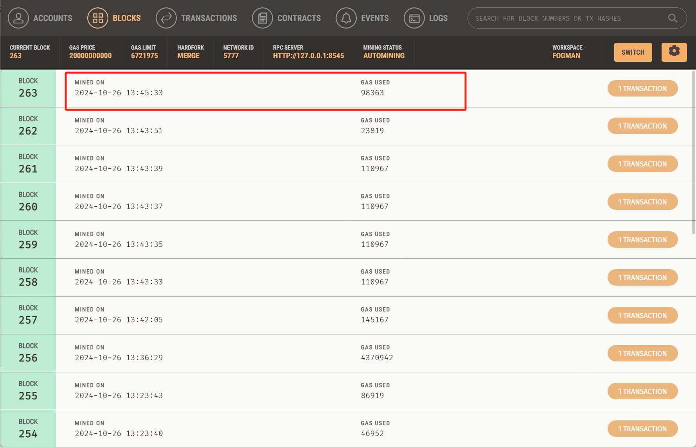

# Fogman-Housing Transaction System

**以下内容为作业仓库的README.md中需要描述的内容。请根据自己的需要进行修改并提交。**

作业提交方式为：**提交视频文件**和**仓库的链接**到指定邮箱。

## 如何运行

补充如何完整运行你的应用。

1. 在本地启动ganache应用。

2. 在 `./contracts` 中安装需要的依赖，运行如下的命令：
    ```bash
    npm install
    ```

3. 在 `./contracts/contracts` 中编译合约，运行如下的命令：
    ```bash
    npx hardhat compile
    ```

4. 在 `./contracts` 中部署合约，运行如下的命令：
    ```bash
    npx hardhat run scripts/deploy.ts --network localhost
    ```

5. 将部署得到的 `BuyMyRoom` 和 `ERC20` 的地址修改到前端 `src/utils/contract-address.json` 文件中

    ```shell
    BuyMyRoom deployed to 0x33CbAEFCD80D83e3375961649FBc2AF98694933D
    ERC20 deployed to 0x7703Af21583a657821D652EDCEDD6573B0406221
    ```

6. 在 `./frontend` 中安装需要的依赖，运行如下的命令：
    ```bash
    npm install
    ```

7. 在 `./frontend` 中启动前端程序，运行如下的命令：
    ```bash
    npm run start
    ```

## 功能实现分析

1. 创建了一个ERC721合约，在合约中发行房屋商品。每个用户共可以免费领取5个房屋，用于之后的测试

   ```solidity
   mapping(address => uint256) public myHouseCount;
   function recieveHouse() external {
           require(myHouseCount[msg.sender] < 5, "No more house to recieve");
           _mint(msg.sender, nextHouseId);
           houses[nextHouseId] = House(msg.sender, block.timestamp, 0, false);
           nextHouseId++;
           myHouseCount[msg.sender]++;
       }
   ```

   ​	函数`recieveHouse()`中实现了这一功能，其中使用了一个mapping `myHouseCount`来记录用户已经领取过的房屋的数量，并限制用户领取的房屋数量不能超过5。

   ​	领取过程中直接设置好房屋的`Id`（反正房屋只能通过用户免费领取**产生**并进行交易，不会凭空多出新的房屋），通过`nextHouseId`指示下一个要发放的房屋的`Id`，每次发放一个房屋会加1。

2. 用户查看自己拥有的房产列表。并可以挂单出售自己的房屋（挂单包含价格等信息）

   ```solidity
   	// 查询用户拥有的房屋
       function getHouseByOwner(address owner) external view returns(uint256[] memory) {
           uint256[] memory result = new uint256[](balanceOf(owner));
           uint256 idx = 0;
           for (uint256 i = 1; i < nextHouseId; i++) {
               if(ownerOf(i) == owner) {
                   result[idx++] = i;
               }
           }
           return result;
       }
       
   	// 上架房屋
       function listHouse(uint256 houseId, uint256 price) external {
           require(houses[houseId].owner == msg.sender, "You are not the owner of this house");
           require(houses[houseId].isOnSale == false, "This house is already on sale");
           houses[houseId].price = price;
           houses[houseId].isOnSale = true;
           houses[houseId].listedTimestamp = block.timestamp;
           onSaleHouseCount++;
           emit HouseListed(houseId, price, msg.sender);
       }
   ```

   ​	函数`getHouseByOwner`实现了查看用户拥有的房屋这一功能。遍历一遍房屋数组，从中获取到属于用户的房屋。

   ​	函数`listHouse`实现了将房屋上架出售的功能，需要的参数为房屋Id`houseId`和上架的价格`price`。在函数中首先要保证发起上架请求的人是房屋的主人，并且房屋当前并不在上架栏中（实际上根本不会出现这两种情况，在这里写下这两个限制条件只是加了一层保险）。通过两层检验后设置该房屋的价格、上架状态和上架时间（为了之后算手续费要用）。

   ```solidity
   	// 下架房屋
       function unListHouse(uint256 houseId) external {
           require(houses[houseId].owner == msg.sender, "You are not the owner of this house");
           require(houses[houseId].isOnSale == true, "This house is not on sale");
           houses[houseId].isOnSale = false;
           onSaleHouseCount--;
       }
   ```

   ​	此外，我们还实现了下架房屋的方法。同样地，首先要保证发起下架请求的人是房屋的所有者，并且房屋当前正在销售中，然后我们只需设置房屋的上架状态为`false`即可。

3. 用户查看所有出售中的房产，并查询一栋房产的主人，及各种挂单信息。

   ```solidity
   	// 查询所有在售房屋
       function getHousesForSale() external view returns(uint256[] memory) {
           uint256[] memory result = new uint256[](onSaleHouseCount);
           uint256 idx = 0;
           for (uint256 i = 1; i < nextHouseId; i++) {
               if (houses[i].isOnSale == true) {
                   result[idx] = i;
                   idx++;
               }
           }
           return result;
       }
       // 查询房屋信息
       function getHouseInfo(uint256 houseId) external view returns(address, uint256, uint256) {
           return (houses[houseId].owner, houses[houseId].price, houses[houseId].listedTimestamp);
       }
   ```

   每次刷新页面或是执行买房卖房操作后，都会在前端刷新房屋的上架栏。函数`getHousesForSale`实现了这一功能。首先建立一个`result`数组，用于存放在售房屋的信息，数组大小指定为`onSaleHouseCount`。这一数字在合约初始化时设为0，之后每次上架房屋时都会加一；每次下架房屋或者购买房屋时都会减一。接着，遍历整个`houses`数组，如遇到在售状态为`true`的房屋，即放入`result`数组中，最后返回。

   查询房屋信息的功能实现在函数`getHouseInfo`中，根据房屋Id返回该房屋的所有者、价格、上架时间信息。

4. 用户通过ERC20代币购买房屋，购买后房屋所有权会发生变化，且平台会根据房屋挂单的时长收取售出方一定的手续费。

   ```solidity
   	// 用户使用 ERC20 代币购买房屋
       function buyHouseWithTokens(uint256 houseId) external {
           require(houses[houseId].isOnSale, "House not for sale");
           require(houses[houseId].owner != msg.sender, "Can not buy owned house");
           require(myERC20.balanceOf(msg.sender) >= houses[houseId].price, "Not enough tokens");
   
           // 手续费
           uint256 premium = (block.timestamp - houses[houseId].listedTimestamp) / 1000000 * houses[houseId].price;
   
           myERC20.transferFrom(msg.sender, ownerOf(houseId), houses[houseId].price - premium);
           myERC20.transferFrom(msg.sender, contractOwner, premium);
           houses[houseId].isOnSale = false;
           _transfer(ownerOf(houseId), msg.sender, houseId);
           houses[houseId].owner = msg.sender;
           onSaleHouseCount--;
   
           emit HouseSold(houseId, houses[houseId].price, msg.sender);
       }
   ```

   这一功能使用`buyHouseWithTokens`函数实现，首先要保证房屋在售出状态，且购买者不能是售出者（如果想赎回来房子的话直接下架房屋就好了，不用这样折腾还要花些手续费hhh），并且还需要保证购买者现有的代币数量大于等于房子的价格。

   接着，根据房屋挂出的时长计算手续费，然后执行两个`transfer`函数，售出者获得收入，购买者花掉部分钱。并设置该房屋的在售状态为`false`、所有权设为购买方。

5. 发行一个（ERC20）合约，允许用户将测试以太币兑换成ERC20积分，并使用ERC20积分完成购买房屋的流程。

   ```solidity
   contract MyERC20 is ERC20{
       constructor(string memory name, string memory symbol) ERC20(name, symbol) {
           _mint(msg.sender, 1000000 * 10 ** decimals());
       }
   
       function mint(address to, uint256 amount) external {
           _mint(to, amount);
       }
   }
   	// 用户使用以太币兑换 ERC20 代币
       function buyTokens() external payable {
           require(msg.value > 0, "No ether sent");
           uint256 tokensToMint = msg.value;
           myERC20.mint(msg.sender, tokensToMint);
           payable(contractOwner).transfer(msg.value);
       }
       // 查看拥有的 ERC20 代币
       function getMyERC20() external view returns(uint256) {
           return myERC20.balanceOf(msg.sender);
       }
   ```

   参考[模版](https://wizard.openzeppelin.com/#erc20)，实现了发行自己的一个ERC20合约，用户可以将以太币兑换为ERC20代币，我们设置的兑换比例为1 ether => 1 ERC代币。兑换后将以太币转发给管理员。

   用户可以查看自己所拥有的ERC20代币，功能在函数`getMyERC20`中实现。前端每次刷新页面或者进行买卖房屋相关操作后都会加载用户当前拥有的ERC20代币数量。


## 项目运行截图

1. 项目启动时ganache状态如下：

   

   本次实验我们使用前四个账号进行测试。由于先前已经进行过很多次测试了，所以账户状态并不是创建时的初始状态。但这不要紧，看到之后的变化就可以了。

   

   

2. 登录meta mask钱包，并绑定账户，进入`localhost:3000`页面，即可看到我们的交易系统：

   

   页面中显示当前用户、我的房产、出售中的房产、兑换ERC20代币几大功能。当然，现在我们一个房子也没有，也没有售出中的房产。

3. 领取房屋。

   

   我们成功领取了一套房子，ID为1.

   

   

   此时ganache中也多了一笔交易和一个区块。

   每个用户最多可以领取五套房子，之后再要领取的话就会报错，如下图所示：

   

4. 上架/下架房屋：

   我们以5ERC20代币的价格上架ID为2的房屋：

   

   此时ganache中多出了相关的交易和区块：

   

   

   从这个列表中也能看出，前面6个区块是成功领取5套房子的5个区块和领取失败的一个区块。

5. 下架房屋：

   

   仍使用当前用户下架房屋，是可以下架成功的。

   此时ganache中也对应地多了一个transaction和一个区块。

   

   

   再次以5 ERC20代币的价格上架ID为2的房屋，然后切换到另一个账户尝试下架房屋，会发现不行：

   

6. 兑换ERC20代币

   兑换前的状态：

   

   兑换10个ERC代币：

   

   

   正如前面的内容提到的，我们设置的兑换比例是1：1，所以兑换得到了10个ERC代币，相应地ETH就少了10.

   ganache中也增加了对应的交易信息：

   

7. 购买房产

   

   首先查看在售的房屋信息，可以看到房屋主人、价格、上架时间三条信息。

   接着点击购买，我们可以自定义设置支出上限

   

   然后下一步，就可以购买房屋了：

   

   购买成功，房子现在是用户`0xA65E478ba75FA78950Ec18D0eE215D45dB659a93`的了。相应地，可以看到用户`0xA65E478ba75FA78950Ec18D0eE215D45dB659a93`的ERC代币余额变成了5.

   然后我们再切换回去售出方的账户查看：

   

   可以看到，用户`0xc44aea6b76e591fc8716044e3cbfb027387aa046`的房产就少了ID为2的房屋，且其ERC20代币余额增加了5（原先是0）.

   ganache中也可以看到相关交易信息：

   

   以上截图可能无法完全展示本交易系统的所有功能。您可以查看以下视频：

   <video src="演示视频.mp4"></video>

## 参考内容

- 课程的参考Demo见：[DEMOs](https://github.com/LBruyne/blockchain-course-demos)。

- 快速实现 ERC721 和 ERC20：[模版](https://wizard.openzeppelin.com/#erc20)。记得安装相关依赖 ``"@openzeppelin/contracts": "^5.0.0"``。

- 如何实现ETH和ERC20的兑换？ [参考讲解](https://www.wtf.academy/en/docs/solidity-103/DEX/)
